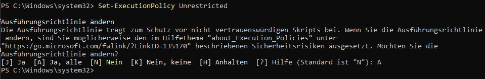
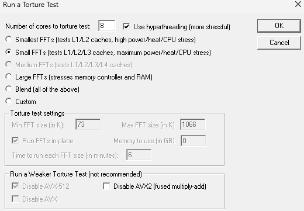
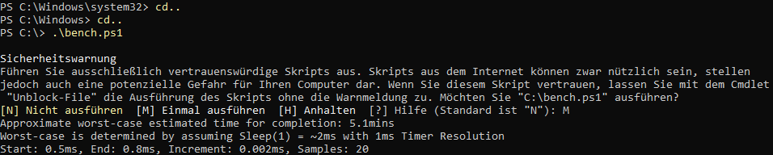
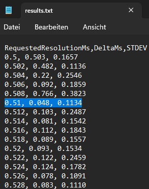
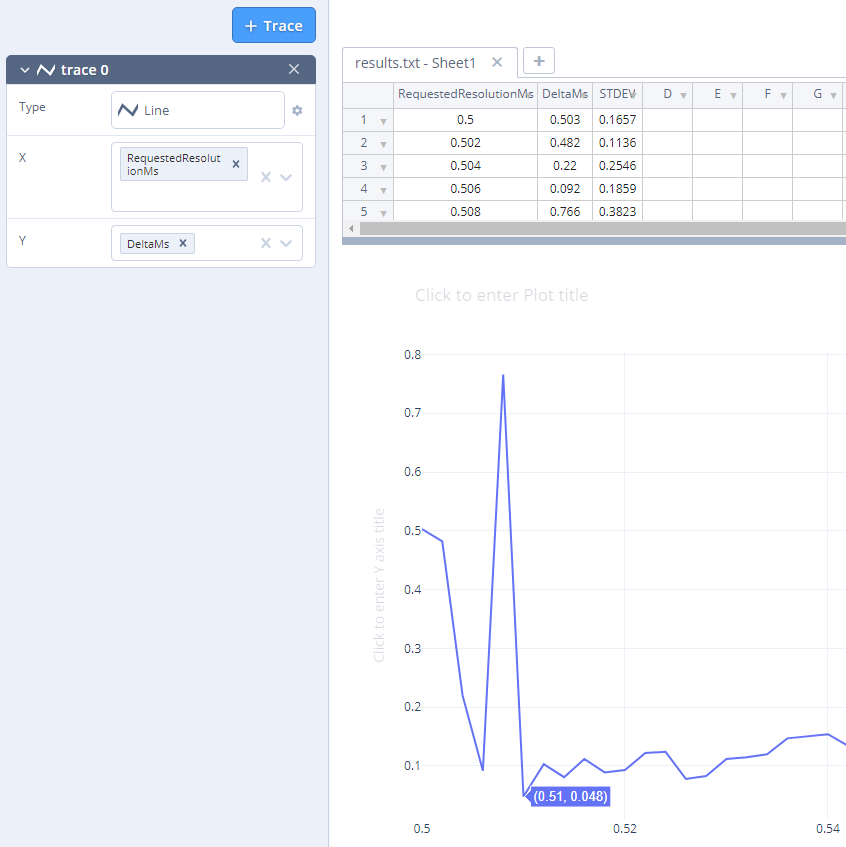
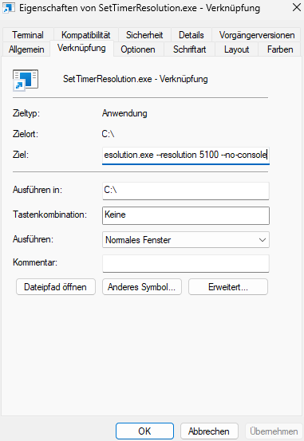
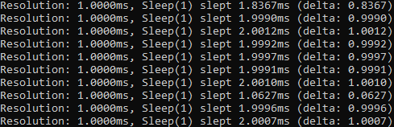
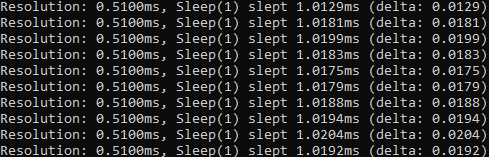
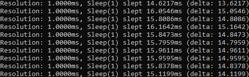
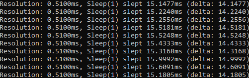

# Timer Resolution
Timer Resolution refers to the smallest unit of time that a timer can measure. It is a concept often used in the context of software and operating systems, particularly in high-resolution timing and performance-critical applications.

## Why should you use Timer Resolution
Timer resolution affects the ***precision and accuracy*** of time measurements. A higher timer resolution means the timer can measure smaller intervals, leading to more precise and accurate timing.
In applications where precise timing is critical, such as audio and video processing, gaming, and real-time control systems, high-resolution timers ensure ***smooth and accurate*** operation.
High-resolution timers can help ***reduce latency*** in time-sensitive applications, leading to ***faster and more responsive*** systems.
On Windows, the default system timer resolution is typically around ***15.6ms*** and with Timer Resolution it drops down to around ***0.5ms***.

## Why "Better" Timer Resolution
It is evident that the timer resolution of 0.5ms is ***not*** a viable option for all users, as it may even result in a deterioration of performance.
Therefore, it is necessary to adjust the timer resolution to the specific resolution that the user's PC can handle optimally.

## Requirements
- Windows 11
- Registry Editor
- CPU Stress Test (Prime95)
- bench.ps1
- MeasureSleep.exe
- SetTimerResolution.exe

## How to tune Timer Resolution
1. Copy **bench.ps1**, **MeasureSleep.exe** and **SetTimerResolution.exe** into **C: drive**

2. Open Registry-Editor and go to ***"HKEY_LOCAL_MACHINE\SYSTEM\CurrentControlSet\Control\Session Manager\kernel"***, then create a new dword called ***"GlobalTimerResolutionRequests"*** with the value set to ***"1"***

3. Open ***CMD*** as ***Admin*** and use this command: ***"bcdedit /set disabledynamictick yes"***

4. ***Restart*** your PC

5. Open ***Windows PowerShell*** as ***Admin*** and use this command: ***"Set-ExecutionPolicy Unrestricted"*** after that press ***"A"*** and ***enter***

6. Use a ***CPU Stress Test*** (for me I used Prime95) so the CPU operates at the highest P-State P0.
- ***Warning!***: Running a CPU stress-test or benchmark can cause overheating, system instability, and accelerated hardware wear. Ensure adequate cooling, monitor system health, and avoid prolonged testing to prevent potential damage.
- Link to download Prime95: https://www.mersenne.org/download/

7. Run ***Windows PowerShell*** as ***Admin*** and use these commands: ***"cd.."***, ***"cd.."***, ***".\bench.ps1"*** and ***"R"*** or in my case ***"M"*** to run it once and ***enter***
- It will run for about 5min
- After it is finished you can close it

8. After the Benchmark is finished there will be a file called ***"results.txt"*** with important informations, but you might only need the first 20 or less
- ***Now you should stop and exit your CPU Stress Test!***
- You need to look after the ***lowest DeltaMs*** and ***STDEV***, in my case it is at ***0.51ms*** (your results ***can and will*** be completely different)
- You can also plot the results on this website: https://chart-studio.plotly.com/create/#/

9. For ***results*** scroll down to "Testing"

10. To open Timer Resolution on Windows startup press **Win + R** and type ***"shell:startup"*** than create a shortcut of ***"TimerResolution.exe"*** and paste it into that folder
- Right click on the shortcut and type at the end of the path " --resolution 5XXX --no-console" (replace 5XXX with your result from 7.)

## Testing
- All testing is done with the App **MeasureSleep.exe**
- To test it yourself start MeasureSleep.exe as **Admin**
- The ***closer*** the number following "slept" is to ***1*** and the ***lower*** the delta, the ***more optimal*** the outcome

1. **without** Timer Resolution / GlobalTimerResolutionRequests **1** / disabledynamictick **yes**

2. **with** Timer Resolution at 0.51ms / GlobalTimerResolutionRequests **1** / disabledynamictick **yes**

3. **without** Timer Resolution / GlobalTimerResolutionRequests **0** / disabledynamictick **false**

4. **with** Timer Resolution at 0.51ms / GlobalTimerResolutionRequests **0** / disabledynamictick **false**

## Benchmark
- test was done in CS2 in a custom workshop map

My PC Specs:
- Windows 11 23H2
- Ryzen 7 5800x3D (-30 CO Curve / PPT: 100, TDC: 70, EDC: 100)
- MSI B550 Gaming Plus
- Gigabyte RTX 3070 Gaming OC (undervolted) 556.12
- Corsair Vengeance RGB RT 3600MHz CL16
- WD_BLACK SN850X 2TB

## Credits
***amitxv*** deserves all the credit. You can visit him at https://github.com/amitxv
