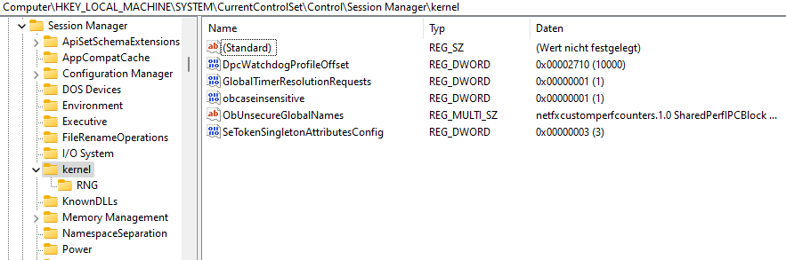
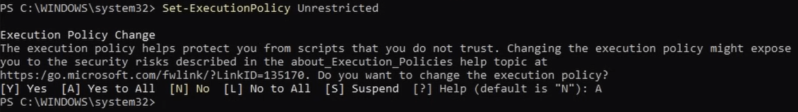

# Timer Resolution
Timer Resolution refers to the smallest unit of time that a timer can measure. It is a concept often used in the context of software and operating systems, particularly in high-resolution timing and performance-critical applications.

## Why should you use Timer Resolution:
Timer resolution affects the ***precision and accuracy*** of time measurements. A higher timer resolution means the timer can measure smaller intervals, leading to more precise and accurate timing.
In applications where precise timing is critical, such as audio and video processing, gaming, and real-time control systems, high-resolution timers ensure ***smooth and accurate*** operation.
High-resolution timers can help ***reduce latency*** in time-sensitive applications, leading to ***faster and more responsive*** systems.
On Windows, the default system timer resolution is typically around ***15.6ms*** and with Timer Resolution it drops down to around ***0.5ms***.

## Why "Better" Timer Resolution:
It is evident that the timer resolution of 0.5ms is ***not*** a viable option for all users, as it may even result in a deterioration of performance.
Therefore, it is necessary to adjust the timer resolution to the specific resolution that the user's PC can handle optimally.

## How to tune Timer Resolution:
- Open Regestry-Editor and go to ***HKEY_LOCAL_MACHINE\SYSTEM\CurrentControlSet\Control\Session Manager\kernel***, than create a dword called ***GlobalTimerResolutionRequests*** with the value set to 1.

- Open Windows PowerShell as Admin and use this command: ***Set-ExecutionPolicy Unrestricted*** after that press ***"A"*** and ***enter***.

