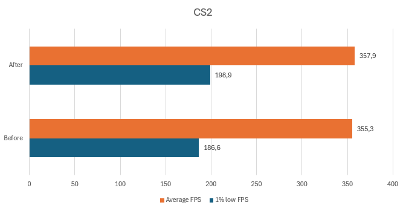

# Warning!
> **Please be advised that this procedure is to be carried out at your own risk.**
> There is a possibility that it will result in an increase in power.
> It should be noted that this may be a placebo effect.

## Timer Resolution

**Timer Resolution** refers to the smallest unit of time that a timer can measure. It is a crucial concept in software and operating systems, especially in high-resolution timing and performance-critical applications.

## Why Should You Use Timer Resolution?

Timer resolution affects the **precision and accuracy** of time measurements. A higher timer resolution allows for more precise timing, which is essential in various applications, such as:

- **Audio and video processing**
- **Gaming**
- **Real-time control systems**

In these scenarios, high-resolution timers help to **reduce latency** and ensure **smooth and accurate** operations, resulting in **faster and more responsive** systems.

On Windows, the default system timer resolution is typically around **15.6ms**. With Timer Resolution adjustments, it can be reduced to around **0.5ms**. [Results](https://github.com/plankeeee/BetterTimerResolution?tab=readme-ov-file#testing)

## Why "Better" Timer Resolution?

A timer resolution of 0.5ms may not be suitable for all users as it can potentially deteriorate performance. Therefore, it is essential to adjust the timer resolution to the optimal setting for your specific system.

## Requirements

- Windows 11
- Registry Editor
- CPU Stress Test (Prime95)
- `bench.ps1`
- `MeasureSleep.exe`
- `SetTimerResolution.exe`

## How to Tune Timer Resolution

1. Copy `bench.ps1`, `MeasureSleep.exe`, and `SetTimerResolution.exe` into the **C: drive**.

2. Open Registry Editor and navigate to `HKEY_LOCAL_MACHINE\SYSTEM\CurrentControlSet\Control\Session Manager\kernel`. Create a new DWORD called `GlobalTimerResolutionRequests` with the value set to `1`.

   

3. Open **CMD** as **Admin** and execute:  
   ```cmd
   bcdedit /set disabledynamictick yes
   ```

   

4. Restart Your PC

5. Open **Windows PowerShell** as **Admin** and execute:  
   ```powershell
   Set-ExecutionPolicy Unrestricted
   ```  
   After that, press **"A"** and **enter**.

   

6. Use a **CPU Stress Test** (e.g., Prime95) to operate the CPU at the highest P-State P0.  
   > **Warning!**: Running a CPU stress test can cause overheating, system instability, and accelerated hardware wear. Ensure adequate cooling and monitor system health.

   

7. Open **Windows PowerShell** as **Admin** and navigate to the root directory using:  
   ```powershell
   cd..
   cd..
   .\bench.ps1
   ```  
   Choose **"R"** (or in some cases **"M"**) to run it once and press **enter**.  
   > The benchmark will run for about 5 minutes. After it finishes, you can close it.

   

8. After the benchmark, a file called `results.txt` will be created. Look for the **lowest DeltaMs** and **STDEV** values. For me it is **0.51ms** (results can vary).  
   > You can also plot the results on [Plotly](https://chart-studio.plotly.com/create/#/).

   
   

9. Press **Win + R**, type `shell:startup`, and create a shortcut for `TimerResolution.exe`. Paste it into the startup folder and modify the shortcut path to include:  
   ```
   --resolution 5XXX --no-console
   ```  
   (Replace `5XXX` with your result from step 7.)

   

## Testing

All testing was conducted with the application **MeasureSleep.exe**. To test, start `MeasureSleep.exe` as **Admin** and observe the results. The goal is for the number following "slept" to be close to **1** and the delta to be low, indicating optimal performance.

1. **Without Timer Resolution / GlobalTimerResolutionRequests 0 / disabledynamictick false**  
   

2. **Without Timer Resolution / GlobalTimerResolutionRequests 1 / disabledynamictick yes**  
   

3. **With Timer Resolution at 0.51ms / GlobalTimerResolutionRequests 0 / disabledynamictick false**  
   

4. **With Timer Resolution at 0.51ms / GlobalTimerResolutionRequests 1 / disabledynamictick yes**  
   

## Benchmark

Testing was performed in Counter-Strike 2 on a custom workshop map. (All settings are at high)



### My PC Specs

- **OS**: Windows 11 23H2
- **CPU**: Ryzen 7 5800x3D (-30 CO Curve / PPT: 100, TDC: 70, EDC: 100)
- **Motherboard**: MSI B550 Gaming Plus
- **GPU**: Gigabyte RTX 3070 Gaming OC (undervolted) 556.12
- **RAM**: Corsair Vengeance RGB RT 3600MHz CL16
- **Storage**: WD_BLACK SN850X 2TB

## Credits

All credit goes to **amitxv**. You can visit his profile at [GitHub](https://github.com/amitxv).
